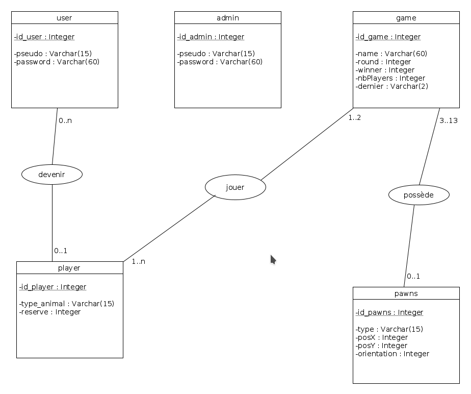

Membres du projet :
Melvin Beaussart
Sebastien Duterte

1-Choix Techniques :

Pour l'administrateur, il peut rejoindre n'importe quelle partie de la base
et jouer n'importe quel camp à n'importe quel moment.(il lui suffit de cliquer sur le bouton de
changement d'animal).
C'est à dire que, pendant le tour du rhinocéros, il peut jouer l'éléphant même si ce n'est pas son tour.
Pareil pour l'inverse.

Concernant la base de données, nous avons choisi de ne pas modéliser dans
la table pawns les pions qui sont en dehors du plateau (cela permet de
traiter moins de données).

Aussi, pour traiter les insertions en poussée, nous avons choisi de les gérer en fonction
de l'orientation choisie par le joueur. Ainsi, en fonction de l'orientation choisie,
une poussée en insertion sera effectuée, exemple : L'utilisateur tente une insertion dans le coin en haut à droite
du plateau, s'il oriente son pion en réserve vers le bas, alors une poussée vers le bas sera effectuée. S'il
l'oriente vers la droite, alors la poussée en insertion se fera vers la droite.
Et enfin, s'il oriente son pion en réserve vers le haut, ou vers le bas, le pion n'est pas inséré
car la poussée n'est pas possible.
Nous avons fait ce choix afin de ne pas avoir de flêches autours du tableau pour choisir son insertion en poussée.
Cela garde l'esthetique du jeu intacte, tout en étant pratique et facile à prendre en main.

2-Architecture choisie :
Js + ajax : Règles du jeu et accès aux données
Php : Accès à la base de donnée + encodage des données pour les récupérer en javascript

Nous avons choisi cette architecture car cela évite de surcharger les
requêtes sur le serveur et d'avoir un affichage dynamique sans avoir
besoin de recharger la page à chaque coup joué.

Pour tester le jeu, nous avons crée deux comptes joueurs, et un compte administrateur :
Comptes joueurs :
Pseudo : Sebastien
Mot de passe : test

Pseudo : Melvin
Mot de passe : test

Compte administrateur :
Pseudo : admin
Mot de passe : admin

3- schéma de la base de données :

Les mots de passe administrateur et joueurs sont cryptés.
